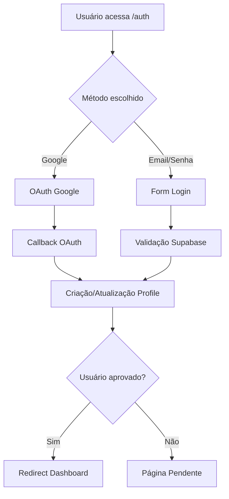
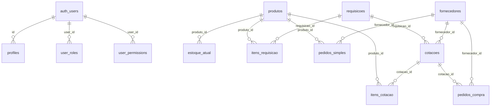
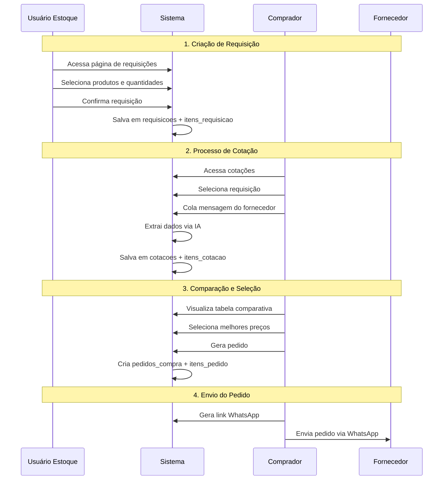
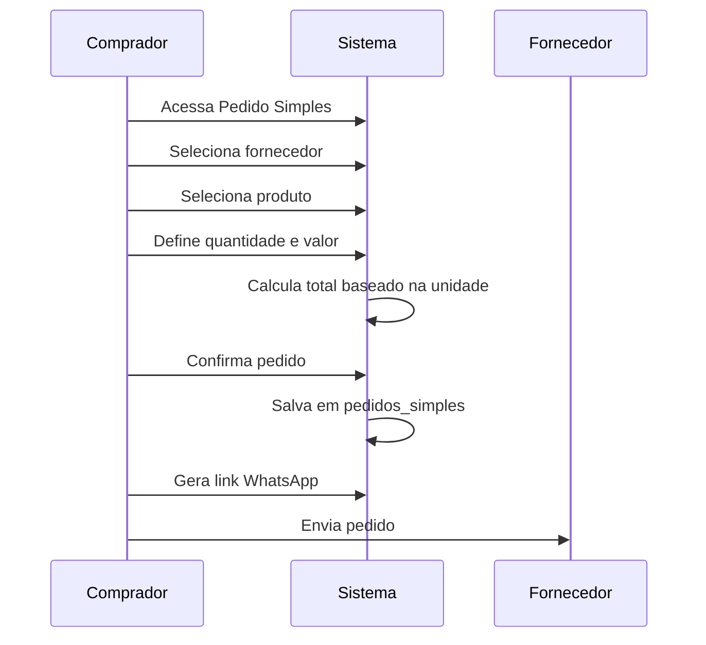
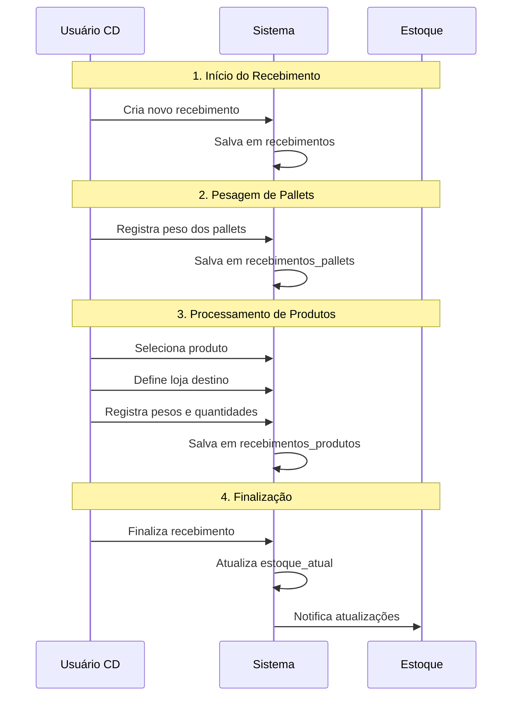
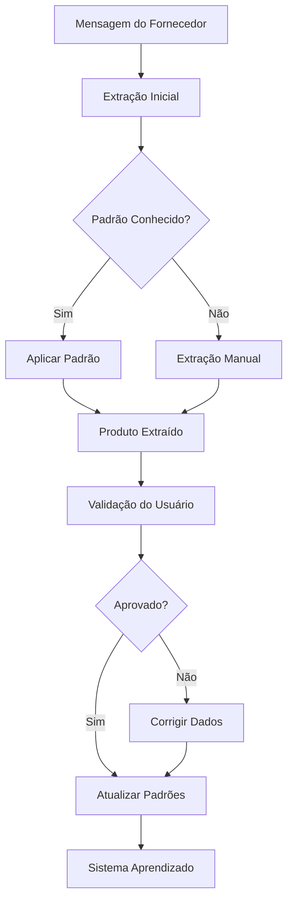

# Documentação do Sistema FLV - Supermercado Dalpozzo

## Índice
1. [Visão Geral](#visão-geral)
2. [Arquitetura do Sistema](#arquitetura-do-sistema)
3. [Autenticação e Segurança](#autenticação-e-segurança)
4. [Gerenciamento de Usuários e Permissões](#gerenciamento-de-usuários-e-permissões)
5. [Módulos Funcionais](#módulos-funcionais)
6. [Estrutura do Banco de Dados](#estrutura-do-banco-de-dados)
7. [Fluxos de Trabalho](#fluxos-de-trabalho)
8. [API e Integrations](#api-e-integrations)
9. [Interface do Usuário](#interface-do-usuário)
10. [Configurações e Manutenção](#configurações-e-manutenção)

---

## Visão Geral

### Objetivo
O Sistema FLV é uma aplicação web desenvolvida especificamente para digitalizar e otimizar o processo de compras de frutas, legumes e verduras (FLV) do Supermercado Dalpozzo. O sistema substitui processos manuais tradicionais (papel, caneta, impressões) por um fluxo digital completo e integrado.

### Principais Benefícios
- **Digitalização Completa**: Eliminação de processos manuais
- **Automatização Inteligente**: Leitura automática de mensagens de fornecedores
- **Comparação de Preços**: Interface visual para comparação entre fornecedores
- **Gestão Centralizada**: Controle unificado de estoque, requisições e pedidos
- **Rastreabilidade**: Histórico completo de todas as operações

### Tecnologias Utilizadas
- **Frontend**: React 18 + TypeScript + Vite
- **Styling**: Tailwind CSS + shadcn/ui
- **Backend**: Supabase (PostgreSQL + Edge Functions)
- **Autenticação**: Supabase Auth (Google OAuth)
- **Estado**: React Hooks + Context API
- **Roteamento**: React Router v6

---

## Arquitetura do Sistema

### Estrutura Geral
```
Sistema FLV
├── Frontend (React/TypeScript)
│   ├── Componentes UI
│   ├── Páginas
│   ├── Hooks Customizados
│   ├── Contextos
│   └── Utilitários
├── Backend (Supabase)
│   ├── Banco de Dados (PostgreSQL)
│   ├── Autenticação
│   ├── Edge Functions
│   └── Row Level Security (RLS)
└── Integrações
    ├── Google OAuth
    └── WhatsApp (geração de mensagens)
```

### Padrões Arquiteturais
- **MVC Pattern**: Separação clara entre lógica, dados e apresentação
- **Hooks Pattern**: Lógica reutilizável através de custom hooks
- **Context Pattern**: Gerenciamento de estado global
- **Security by Design**: RLS em todas as tabelas críticas

---

## Autenticação e Segurança

### Sistema de Autenticação
O sistema utiliza **Supabase Auth** com suporte a:

#### Métodos de Login
1. **Google OAuth** (Principal)
   - Integração com Google Cloud Platform
   - Redirecionamento automático pós-login
   - Sincronização de perfil do Google

2. **Email/Senha** (Secundário)
   - Validação robusta de credenciais
   - Recuperação de senha via email

#### Fluxo de Autenticação


#### Segurança Implementada
- **Row Level Security (RLS)**: Todas as tabelas protegidas
- **JWT Tokens**: Renovação automática
- **Session Management**: Controle de sessão persistente
- **CORS Protection**: Headers de segurança configurados

### Contexto de Autenticação (`AuthContext`)
```typescript
interface AuthContextType {
  user: User | null;
  session: Session | null;
  loading: boolean;
  signInWithGoogle: () => Promise<{success: boolean; error?: string}>;
  signOut: () => Promise<void>;
  hasRole: (role: string) => boolean;
}
```

---

## Gerenciamento de Usuários e Permissões

### Hierarquia de Usuários
O sistema implementa 4 tipos de usuários com diferentes níveis de acesso:

#### 1. **Master** 
- **Acesso**: Total ao sistema
- **Permissões**: Todas as funcionalidades
- **Responsabilidades**: Administração geral, configurações, aprovação de usuários

#### 2. **Comprador**
- **Acesso**: Cotações, requisições, pedidos, históricos
- **Permissões**: Criar/editar cotações, gerenciar fornecedores
- **Responsabilidades**: Processo de compras, negociação com fornecedores

#### 3. **Estoque**
- **Acesso**: Estoque, requisições
- **Permissões**: Atualizar estoque, criar requisições
- **Responsabilidades**: Controle de estoque por loja

#### 4. **CD (Centro de Distribuição)**
- **Acesso**: Gestão CD, recebimentos, transferências
- **Permissões**: Processar recebimentos, gerenciar transferências
- **Responsabilidades**: Operações do centro de distribuição

### Sistema de Permissões
#### Tabelas de Controle
- `user_roles`: Vincula usuários a roles
- `user_permissions`: Permissões granulares por recurso/ação
- `usuarios`: Dados básicos do usuário (compatibilidade)
- `profiles`: Profile estendido (Supabase Auth)

#### Recursos Controlados
```typescript
enum SystemResource {
  dashboard = "dashboard",
  estoque = "estoque", 
  requisicoes = "requisicoes",
  cotacao = "cotacao",
  gestao_cd = "gestao_cd",
  configuracoes = "configuracoes",
  historico_requisicoes = "historico_requisicoes",
  historico_pedidos = "historico_pedidos"
}

enum PermissionAction {
  view = "view",
  edit = "edit", 
  create = "create",
  delete = "delete"
}
```

#### Funções de Segurança (PostgreSQL)
- `is_user_master()`: Verifica se usuário é master
- `get_user_role()`: Retorna role do usuário
- `get_user_loja_new()`: Retorna loja do usuário
- `user_has_permission()`: Verifica permissão específica
- `has_role()`: Verifica role específica

---

## Módulos Funcionais

### 1. Dashboard
**Localização**: `src/pages/Dashboard.tsx`

**Funcionalidades**:
- Visão geral do sistema por tipo de usuário
- Métricas e indicadores principais
- Acesso rápido às funcionalidades mais utilizadas
- Status de sincronização e saúde do sistema

### 2. Gestão de Estoque
**Localização**: `src/pages/Estoque.tsx`

**Funcionalidades**:
- Atualização de estoque por loja
- Interface com botões +/- para ajuste de quantidades
- Controle por produto e variação
- Histórico de alterações

**Tabelas Relacionadas**:
- `estoque_atual`: Estoque por produto/loja
- `estoque_cotacao`: Snapshot para cotações

### 3. Sistema de Requisições
**Localização**: `src/pages/Requisicoes.tsx`

**Funcionalidades**:
- Criação de requisições por loja
- Interface visual de seleção de produtos
- Multiplicadores e escalas automáticas
- Cálculo inteligente de quantidades

**Componentes Principais**:
- `RequisicoesTab`: Criação de requisições
- `ConfirmacaoTab`: Revisão e confirmação
- `ProductCard`: Card individual de produto

**Tabelas Relacionadas**:
- `requisicoes`: Cabeçalho da requisição
- `itens_requisicao`: Itens individuais
- `escala_abastecimento`: Escalas por área

### 4. Sistema de Cotações
**Localização**: `src/pages/Cotacao.tsx`

**Funcionalidades**:
- Extração automática de dados de mensagens de fornecedores
- Comparação visual de preços
- Seleção inteligente de melhores preços
- Geração de pedidos automática

**Componentes Principais**:
- `CotacaoHeader`: Cabeçalho e controles
- `TabelaComparativa`: Comparação de preços
- `ProdutoExtraidoItem`: Item extraído individual
- `FornecedorInput`: Input de mensagens

**Sistema de IA e Aprendizado**:
- `extractionService.ts`: Extração de dados
- `aprendizadoService.ts`: Sistema de aprendizado
- `refinementService.ts`: Refinamento de dados
- `padroes_fornecedores`: Padrões aprendidos

### 5. Pedidos Simples
**Localização**: `src/pages/PedidoSimples.tsx`

**Funcionalidades**:
- Criação rápida de pedidos individuais
- Cálculo automático baseado em unidade
- Histórico de pedidos por fornecedor
- Geração de links WhatsApp

**Lógica de Cálculo**:
```typescript
// Se valor <= 14,99 E unidade for "Caixa"
if (valor <= 14.99 && unidade === 'Caixa' && media_por_caixa) {
  total = valor * media_por_caixa * quantidade;
} else {
  total = valor * quantidade;
}
```

### 6. Gestão do Centro de Distribuição
**Localização**: `src/pages/GestaoCd.tsx`

**Funcionalidades**:
- Controle de recebimentos
- Gestão de transferências entre lojas
- Rastreamento de pallets e produtos
- Resolução de divergências

**Submodulos**:
- `NovoRecebimento.tsx`: Criação de recebimentos
- `RecebimentoAtivo.tsx`: Processamento ativo
- `Transferencias.tsx`: Gestão de transferências

### 7. Configurações
**Localização**: `src/pages/Configuracoes.tsx`

**Funcionalidades**:
- Gestão de produtos e variações
- Cadastro de fornecedores
- Configuração de lojas
- Gerenciamento de usuários
- Configuração de tipos de caixas

**Componentes de Configuração**:
- `ProdutosTab`: Gestão de produtos
- `FornecedoresTab`: Gestão de fornecedores
- `LojasTab`: Configuração de lojas
- `UsuariosTab`: Gerenciamento de usuários

---

## Estrutura do Banco de Dados

### Tabelas Principais

#### Usuários e Autenticação
```sql
-- Profiles (Supabase Auth)
profiles (
  id uuid PRIMARY KEY,
  nome text NOT NULL,
  loja text NOT NULL,
  codigo_acesso text NOT NULL,
  ativo boolean DEFAULT true,
  created_at timestamptz DEFAULT now()
);

-- Usuários (Compatibilidade)
usuarios (
  id uuid PRIMARY KEY,
  nome text NOT NULL,
  loja text NOT NULL,
  tipo text NOT NULL, -- master, comprador, estoque, cd
  aprovado boolean DEFAULT false,
  ativo boolean DEFAULT true
);

-- Roles do Sistema
user_roles (
  id uuid PRIMARY KEY,
  user_id uuid REFERENCES auth.users(id),
  role app_role NOT NULL -- enum: master, comprador, estoque, cd
);

-- Permissões Granulares
user_permissions (
  id uuid PRIMARY KEY,
  user_id uuid NOT NULL,
  resource system_resource NOT NULL,
  action permission_action NOT NULL,
  enabled boolean DEFAULT true
);
```

#### Produtos e Catálogo
```sql
-- Produtos Base
produtos (
  id uuid PRIMARY KEY,
  nome_base text,
  nome_variacao text,
  produto text, -- nome completo
  produto_pai_id uuid REFERENCES produtos(id),
  media_por_caixa numeric DEFAULT 20,
  unidade text,
  ativo boolean DEFAULT true,
  ordem_exibicao integer DEFAULT 0
);

-- Sinônimos para IA
sinonimos_produto (
  id uuid PRIMARY KEY,
  produto_id uuid REFERENCES produtos(id),
  sinonimo text NOT NULL
);

-- View com hierarquia
produtos_com_pai AS (
  SELECT p.*, 
         pai.produto as produto_pai_nome,
         pai.id as produto_pai_id_ref
  FROM produtos p
  LEFT JOIN produtos pai ON p.produto_pai_id = pai.id
);
```

#### Estoque e Inventário
```sql
-- Estoque Atual
estoque_atual (
  id uuid PRIMARY KEY,
  produto_id uuid REFERENCES produtos(id),
  loja text NOT NULL,
  quantidade numeric,
  atualizado_em timestamptz DEFAULT now()
);

-- Snapshot para Cotações
estoque_cotacao (
  id uuid PRIMARY KEY,
  produto_id uuid REFERENCES produtos(id),
  loja text NOT NULL,
  quantidade numeric DEFAULT 0,
  unidade text DEFAULT 'Kg',
  data_atualizacao timestamptz DEFAULT now()
);
```

#### Requisições e Itens
```sql
-- Cabeçalho das Requisições
requisicoes (
  id uuid PRIMARY KEY,
  user_id uuid,
  loja text NOT NULL,
  status text DEFAULT 'pendente',
  data_requisicao timestamptz DEFAULT now()
);

-- Itens das Requisições
itens_requisicao (
  id uuid PRIMARY KEY,
  requisicao_id uuid REFERENCES requisicoes(id),
  produto_id uuid REFERENCES produtos(id),
  quantidade numeric,
  escala smallint,
  multiplicador smallint,
  quantidade_calculada numeric
);
```

#### Sistema de Cotações
```sql
-- Cotações
cotacoes (
  id uuid PRIMARY KEY,
  user_id uuid,
  requisicao_id uuid REFERENCES requisicoes(id),
  fornecedor_id uuid REFERENCES fornecedores(id),
  data timestamptz DEFAULT now(),
  produtos_extraidos jsonb,
  tabela_comparativa jsonb
);

-- Itens de Cotação
itens_cotacao (
  id uuid PRIMARY KEY,
  cotacao_id uuid REFERENCES cotacoes(id),
  produto_id uuid REFERENCES produtos(id),
  fornecedor_nome text,
  produto_nome text,
  tipo text,
  preco numeric,
  quantidade numeric,
  unidade text
);
```

#### Fornecedores e Pedidos
```sql
-- Fornecedores
fornecedores (
  id uuid PRIMARY KEY,
  nome text NOT NULL,
  telefone text,
  status_tipo text DEFAULT 'Cotação e Pedido'
);

-- Pedidos de Compra
pedidos_compra (
  id uuid PRIMARY KEY,
  user_id uuid,
  fornecedor_id uuid REFERENCES fornecedores(id),
  cotacao_id uuid REFERENCES cotacoes(id),
  status text DEFAULT 'aberto',
  total numeric DEFAULT 0,
  criado_em timestamptz DEFAULT now()
);

-- Pedidos Simples
pedidos_simples (
  id uuid PRIMARY KEY,
  user_id uuid,
  fornecedor_id uuid REFERENCES fornecedores(id),
  produto_id uuid REFERENCES produtos(id),
  fornecedor_nome text NOT NULL,
  produto_nome text NOT NULL,
  quantidade numeric NOT NULL,
  valor_unitario numeric NOT NULL,
  valor_total_estimado numeric NOT NULL,
  unidade text DEFAULT 'Caixa',
  tipo text,
  data_pedido date NOT NULL,
  observacoes text
);
```

#### Sistema de IA e Aprendizado
```sql
-- Padrões Aprendidos
padroes_fornecedores (
  id uuid PRIMARY KEY,
  fornecedor text NOT NULL,
  padrao_texto text NOT NULL,
  produto_identificado text NOT NULL,
  tipo_identificado text NOT NULL,
  confianca numeric DEFAULT 0,
  ocorrencias integer DEFAULT 1,
  ativo boolean DEFAULT true
);

-- Sistema de Aprendizado
sistema_aprendizado (
  id uuid PRIMARY KEY,
  usuario_id uuid,
  fornecedor text NOT NULL,
  texto_original text NOT NULL,
  produto_extraido text NOT NULL,
  tipo_extraido text NOT NULL,
  preco_extraido numeric,
  produto_corrigido text,
  tipo_corrigido text,
  preco_corrigido numeric,
  aprovado boolean,
  feedback_qualidade integer,
  aplicado boolean DEFAULT false
);
```

#### Centro de Distribuição
```sql
-- Recebimentos
recebimentos (
  id uuid PRIMARY KEY,
  status text DEFAULT 'iniciado',
  fornecedor text,
  origem text,
  iniciado_por uuid,
  finalizado_por uuid,
  total_peso_bruto numeric DEFAULT 0,
  total_peso_liquido numeric DEFAULT 0,
  total_produtos integer DEFAULT 0,
  modo_pesagem text DEFAULT 'individual'
);

-- Pallets dos Recebimentos
recebimentos_pallets (
  id uuid PRIMARY KEY,
  recebimento_id uuid REFERENCES recebimentos(id),
  ordem integer NOT NULL,
  peso_kg numeric NOT NULL,
  observacoes text
);

-- Produtos Recebidos
recebimentos_produtos (
  id uuid PRIMARY KEY,
  recebimento_id uuid REFERENCES recebimentos(id),
  produto_id uuid REFERENCES produtos(id),
  produto_nome text NOT NULL,
  loja_destino text NOT NULL,
  peso_bruto_kg numeric NOT NULL,
  peso_liquido_kg numeric NOT NULL,
  quantidade_caixas integer DEFAULT 0,
  tipo_caixa_id uuid REFERENCES tipos_caixas(id),
  pallets_utilizados integer[],
  estoque_atualizado boolean DEFAULT false
);

-- Transferências
transferencias (
  id uuid PRIMARY KEY,
  loja_origem text DEFAULT 'Home',
  loja_destino text NOT NULL,
  produto_id uuid REFERENCES produtos(id),
  quantidade_requisitada numeric DEFAULT 0,
  quantidade_transferida numeric DEFAULT 0,
  status text DEFAULT 'pendente',
  transferido_por uuid,
  confirmado_por uuid
);
```

### Relacionamentos Chave


---

## Fluxos de Trabalho

### 1. Fluxo de Requisição → Cotação → Pedido



### 2. Fluxo de Pedido Simples



### 3. Fluxo de Recebimento (CD)



### 4. Sistema de Aprendizado de IA



---

## API e Integrations

### Hooks Customizados

#### 1. `useAuth`
```typescript
const useAuth = () => {
  const [user, setUser] = useState<User | null>(null);
  const [session, setSession] = useState<Session | null>(null);
  const [loading, setLoading] = useState(true);

  const signInWithGoogle = async () => { ... };
  const signOut = async () => { ... };
  const hasRole = (role: string) => { ... };

  return { user, session, loading, signInWithGoogle, signOut, hasRole };
};
```

#### 2. `useCotacao`
```typescript
const useCotacao = ({ fornecedores, produtosDB, requisicoes }) => {
  const [produtosExtraidos, setProdutosExtraidos] = useState([]);
  const [fornecedoreProcessados, setFornecedoreProcessados] = useState([]);
  
  const processarMensagem = async () => { ... };
  const editarProdutoExtraido = (produto) => { ... };
  const adicionarProdutoManual = (...args) => { ... };
  
  return {
    produtosExtraidos,
    fornecedoreProcessados,
    processarMensagem,
    editarProdutoExtraido,
    // ... outras funções
  };
};
```

#### 3. `useEstoque`
```typescript
const useEstoque = () => {
  const [estoqueData, setEstoqueData] = useState([]);
  const [loading, setLoading] = useState(true);
  
  const atualizarEstoque = async (produtoId, loja, novaQuantidade) => { ... };
  const buscarEstoque = async () => { ... };
  
  return { estoqueData, loading, atualizarEstoque, buscarEstoque };
};
```

### Serviços de Extração e IA

#### 1. `extractionService.ts`
```typescript
class ExtractionService {
  async extrairProdutosDaMensagem(mensagem: string, fornecedor: string) {
    // Lógica de extração usando padrões e IA
  }
  
  private aplicarPadroesConhecidos(texto: string, fornecedor: string) {
    // Aplica padrões já aprendidos
  }
  
  private extrairComRegex(texto: string) {
    // Extração via regex para casos gerais
  }
}
```

#### 2. `aprendizadoService.ts`
```typescript
class AprendizadoService {
  async salvarFeedback(feedback: FeedbackAprendizado) {
    // Salva feedback do usuário
  }
  
  async atualizarPadroes(dadosAprovados: any[]) {
    // Atualiza padrões baseado em aprovações
  }
}
```

### Integrações Externas

#### 1. WhatsApp
- Geração automática de links `wa.me`
- Formatação de mensagens padronizadas
- Suporte a múltiplos números de fornecedores

#### 2. Google OAuth
- Configuração via Google Cloud Platform
- Redirect URLs configuráveis
- Sincronização de perfil

---

## Interface do Usuário

### Design System

#### Tokens de Design (`index.css`)
```css
:root {
  /* Cores Principais */
  --primary: 142 86% 30%;
  --primary-foreground: 0 0% 98%;
  
  /* Cores Secundárias */
  --secondary: 210 40% 95%;
  --secondary-foreground: 222.2 84% 4.9%;
  
  /* Estados */
  --success: 142 76% 36%;
  --warning: 38 92% 50%;
  --destructive: 0 84% 60%;
  
  /* Backgrounds */
  --background: 0 0% 100%;
  --card: 0 0% 100%;
  --border: 214.3 31.8% 91.4%;
}
```

#### Componentes Base (shadcn/ui)
- `Button`: Botões com variantes
- `Card`: Containers de conteúdo
- `Dialog`: Modais e pop-ups
- `Table`: Tabelas de dados
- `Form`: Formulários validados
- `Select`: Dropdowns e seletores
- `Toast`: Notificações

### Responsividade
- **Mobile First**: Design otimizado para dispositivos móveis
- **Breakpoints**: sm, md, lg, xl, 2xl
- **Componentes Adaptativos**: Diferentes layouts por tela

### Acessibilidade
- **ARIA Labels**: Descrições para screen readers
- **Keyboard Navigation**: Navegação por teclado
- **Color Contrast**: Contraste adequado para daltonismo
- **Focus Management**: Indicadores visuais de foco

---

## Configurações e Manutenção

### Configurações de Ambiente

#### Variáveis Supabase
```env
VITE_SUPABASE_URL=https://pjvqlygmjmajpgitqmsx.supabase.co
VITE_SUPABASE_ANON_KEY=eyJhbGciOiJIUzI1NiIsInR5cCI6IkpXVCJ9...
```

#### Configurações do Projeto
- **Vite Config**: Configurações de build e desenvolvimento
- **Tailwind Config**: Customizações do design system
- **TypeScript Config**: Configurações de tipagem

### Backup e Segurança

#### Backup Automático
- **Supabase**: Backup automático diário
- **Migração de Dados**: Scripts SQL versionados
- **Restore Points**: Pontos de restauração

#### Monitoramento
- **Logs de Sistema**: Registro de atividades
- **Performance**: Métricas de uso
- **Alertas**: Notificações de erros críticos

### Manutenção Preventiva

#### Limpeza de Dados
```sql
-- Limpeza de sessões antigas
DELETE FROM auth.sessions WHERE expires_at < NOW() - INTERVAL '30 days';

-- Limpeza de logs antigos
DELETE FROM transferencias_logs WHERE criado_em < NOW() - INTERVAL '6 months';
```

#### Otimização de Performance
```sql
-- Reindexação periódica
REINDEX TABLE produtos;
REINDEX TABLE estoque_atual;

-- Análise de estatísticas
ANALYZE;
```

### Atualizações e Versioning

#### Migração de Schema
- **Versionamento**: Cada mudança em arquivo separado
- **Rollback**: Capacidade de reverter mudanças
- **Validação**: Testes antes da aplicação

#### Deploy e CI/CD
- **Git Hooks**: Validação automática
- **Supabase CLI**: Deploy de edge functions
- **Ambientes**: Development, Staging, Production

---

## Conclusão

O Sistema FLV representa uma solução completa e moderna para a gestão de compras de FLV, integrando tecnologias avançadas de IA com uma interface intuitiva e processos bem definidos. 

### Principais Conquistas
- ✅ **Digitalização Completa** do processo manual
- ✅ **IA Integrada** para extração automática de dados
- ✅ **Interface Responsiva** para todos os dispositivos
- ✅ **Segurança Robusta** com RLS e autenticação OAuth
- ✅ **Arquitetura Escalável** preparada para crescimento

### Próximos Passos
- **Métricas Avançadas**: Dashboard com KPIs de compras
- **Integrações ERP**: Conexão com sistemas existentes
- **Mobile App**: Aplicativo nativo para dispositivos móveis
- **BI Integration**: Relatórios avançados e analytics

### Suporte e Documentação
- **Documentação Técnica**: Este documento
- **Treinamento**: Material para usuários finais
- **Suporte**: Canal de comunicação para dúvidas
- **Atualizações**: Roadmap de melhorias futuras

---

**Versão**: 1.0  
**Data**: Janeiro 2025  
**Autor**: Sistema FLV - Supermercado Dalpozzo  
**Revisão**: Documentação Completa do Sistema